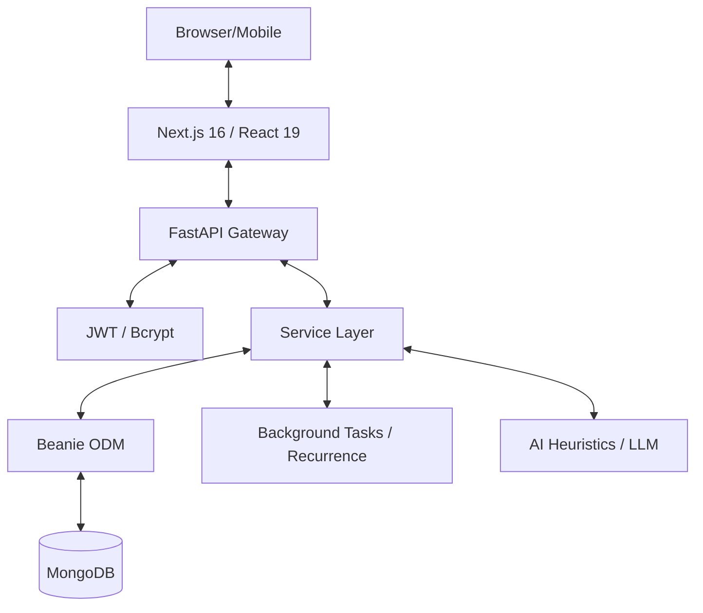
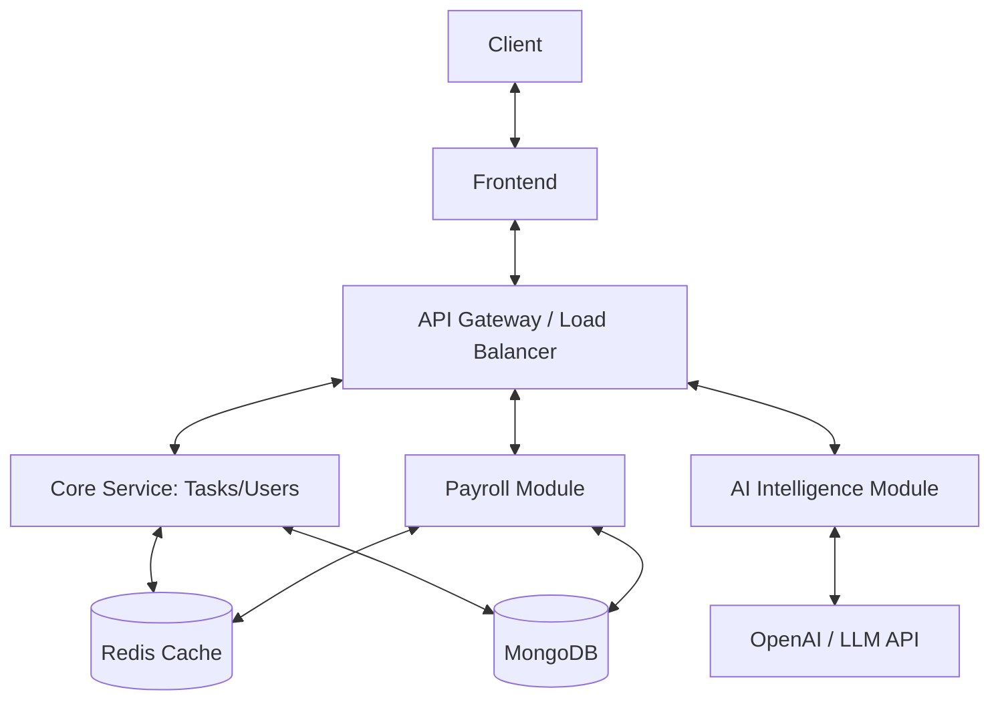

# 🏗️ ARCHITECT - Technical Assessment Report: Employee Task & Reward Management System

## 1. Executive Summary
The **Employee Task & Reward Management System** is a robust, full-stack application designed to automate workforce management, productivity tracking, and payroll. It features a sophisticated gamified reward system and geofence-enabled attendance tracking. The application is built using a modern tech stack (FastAPI, Beanie/MongoDB, Next.js 16) and demonstrates a high degree of maturity in its architecture and documentation.

- **Business Domain:** HR Tech / Workforce Management
- **Overall Health Score:** 8.5/10
- **Primary Strengths:** Comprehensive feature set, clear architectural boundaries, excellent system documentation, and modern UI/UX.
- **Key Risks:** Potential performance bottlenecks in the database layer (memory consumption) and Pydantic V2 migration debt.

---

## 2. Architecture Overview

### Current Architecture Diagram


### Application Flow & Request Lifecycle
1. **Request:** Client sends HTTP request with JWT.
2. **Middleware:** `exception_handler_middleware` catches errors; `CORSMiddleware` handles headers.
3. **Auth:** `get_current_user` dependency decodes JWT, validates user in DB.
4. **RBAC:** `RoleChecker` ensures user has sufficient permissions for the endpoint.
5. **Route:** Pydantic models validate input body/params.
6. **Service:** Business logic executed (e.g., `calculate_corporate_payroll`).
7. **Model:** Beanie ODM interacts with MongoDB.
8. **Response:** Data serialized and returned to Client.

### Recommended Architecture Diagram


---

## 3. Business Logic Reverse Engineering

### Business Process Map
- **Employee Lifecycle:** Register -> Login -> Onboard -> Task Assignment -> Attendance Logging -> Reward Accumulation -> Monthly Payroll -> Payout.
- **Task Lifecycle:** Created -> Assigned -> In Progress -> Under Review -> Completed/Rejected -> Points Awarded.

### Core Workflows
1. **Gamified Productivity:** Tasks are assigned with priorities. Points are calculated dynamically upon completion using timeliness (deadline vs. `completed_at`) and quality multipliers.
2. **Smart Attendance:** Check-ins are validated against a Haversine geofence. Anomalies (drift, device changes) are flagged for HR review.
3. **Automated Payroll:** Net salary is derived from base pay minus Loss of Pay (LOP) from absences, plus incentives from reward points and bonuses for high attendance consistency.

### Feature Breakdown
| Feature | Purpose | Flow | Risks |
|---------|---------|------|-------|
| Task Recurrence | Automation | Background service clones blueprint tasks based on `RecurrenceRule`. | Safety limits on spawning count; blueprint deletion. |
| AI Intelligence | Insights | Heuristic analysis + LLM synthesis (OpenAI) for performance/burnout. | LLM latency; data privacy in prompts. |
| Payroll Engine | Salary | Aggregates Attendance + Leaves + Rewards into monthly drafts. | Edge cases in proration; complex leave logic. |

---

## 4. Bug & Vulnerability Findings

### Logic & API Bugs
| Bug ID | Severity | Category | Location | Description |
|--------|----------|----------|----------|-------------|
| B-001 | Medium | Logic | `payroll.py` | `hiring_date` parsing relies on string matching which fails if format varies (e.g., YYYY/MM/DD). |
| B-002 | Medium | Performance | `attendance.py` | `get_all_attendance` fetches *all* logs into memory via `.to_list()` before user mapping. |
| B-003 | Low | UI | `employees/page.tsx` | Large component (1k+ lines) increases re-render cost and maintenance difficulty. |

### Security Audit
| Finding | Severity | Category | Description |
|---------|----------|----------|-------------|
| S-001 | Low | AuthZ | `global_search` does not strictly enforce hierarchy visibility in the service layer. |
| S-002 | Low | Config | Default `JWT_SECRET` in `config.py` is a weak hardcoded string. |
| S-003 | Info | Privacy | Employee identity docs are served via a public `/uploads` mount without per-file auth checks. |

---

## 5. Performance Findings

| Issue | Location | Impact | Performance Cost | Recommendation |
|-------|----------|--------|------------------|----------------|
| Memory Overload (to_list) | `routes/attendance.py`, `routes/payroll.py` | High | High O(N) memory consumption | Implement pagination and database cursors. |
| Missing Aggregate Ops | `services/reward_service.py` | Medium | In-memory math on large sets | Shift calculations to MongoDB aggregation pipelines. |
| Large Bundle Sizes | `admin/employees/page.tsx` | Low | Slower initial TTI | Decompose large pages and use dynamic imports. |
| Synchronous AI Calls | `services/ai_service.py` | Medium | Latency in API responses | Use background tasks (Celery/FastAPI BackgroundTasks) for LLM synthesis. |

---

## 6. Code Quality & Technical Debt

### Quality Score: 8/10
- **Maintainability:** 8/10 - Code is clean, but some services are becoming "god objects".
- **Readability:** 9/10 - Excellent naming and structure.
- **Testing Score:** 6/10 - Core payroll is tested, but AI and Reward logic lacks unit tests.

### Technical Debt List
| Debt Type | Priority | Impact | Suggested Resolution |
|-----------|----------|--------|----------------------|
| Code | High | Deprecation | Migrate Pydantic V1 `@validator` to V2 `@field_validator`. |
| Architecture | Medium | Coupling | Decouple AI logic from standard routes into a dedicated background worker if LLM calls block. |
| Testing | High | Reliability | Add unit tests for `reward_service.py` and `geofence_utils.py`. |

---

## 7. Test Coverage Risk Report

| Area | Status | Risk Level | Coverage Gaps |
|------|--------|------------|---------------|
| Auth & RBAC | Functional | Low | No dedicated automated security regression tests. |
| Payroll Logic | Tested | Medium | Manual edge cases for partial month proration not fully covered. |
| AI Intelligence | Untested | High | Heuristic algorithms are complex and prone to regressions. |
| Task Gamification | Untested | Medium | Reward point calculation logic has no unit tests. |
| Geofence Utils | Untested | Medium | Haversine distance and drift detection logic untested. |

---

## 8. AI-Assisted Improvements

### Quick Wins (1-2 Days)
| Recommendation | Category | Impact | Effort | Priority | Expected Outcome |
|----------------|----------|--------|--------|----------|------------------|
| Pagination | Performance | High | Low | High | Faster list views and lower memory usage. |
| Pydantic Migration | Debt | Medium | Low | Medium | Elimination of deprecation warnings. |

### Medium-Term (1-4 Weeks)
| Recommendation | Category | Impact | Effort | Priority | Expected Outcome |
|----------------|----------|--------|--------|----------|------------------|
| Component Refactor | Quality | Medium | Medium | Medium | Improved frontend maintainability. |
| Unit Test Expansion | Testing | High | Medium | High | Reduced regression risk in core logic. |

### Long-Term (1-6 Months)
| Recommendation | Category | Impact | Effort | Priority | Expected Outcome |
|----------------|----------|--------|--------|----------|------------------|
| Modularization | Architecture | High | High | Low | Scalable codebase for future features. |
| Caching Layer | Performance | High | Medium | Medium | Reduced DB load for analytics. |

---

## FINAL SCORECARD

```text
Architecture Score:      8/10
Code Quality Score:      8/10
Security Score:          7/10
Performance Score:       6/10
Scalability Score:       7/10
Testing Score:           6/10
Documentation Score:     10/10

Overall Project Health Score: 7.5/10
```

*Report generated by ARCHITECT 🏗️*
